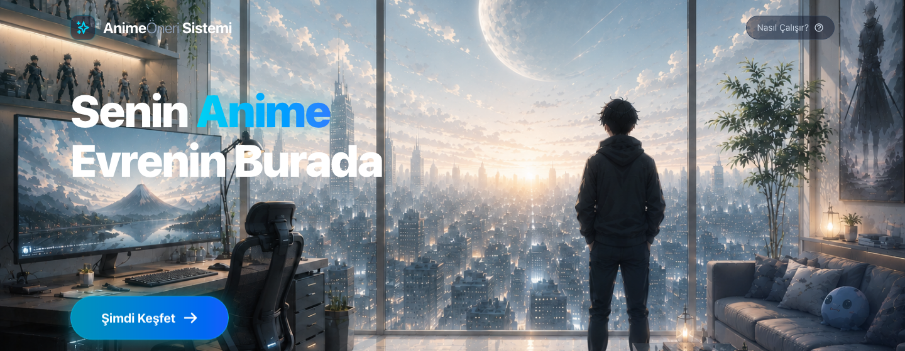
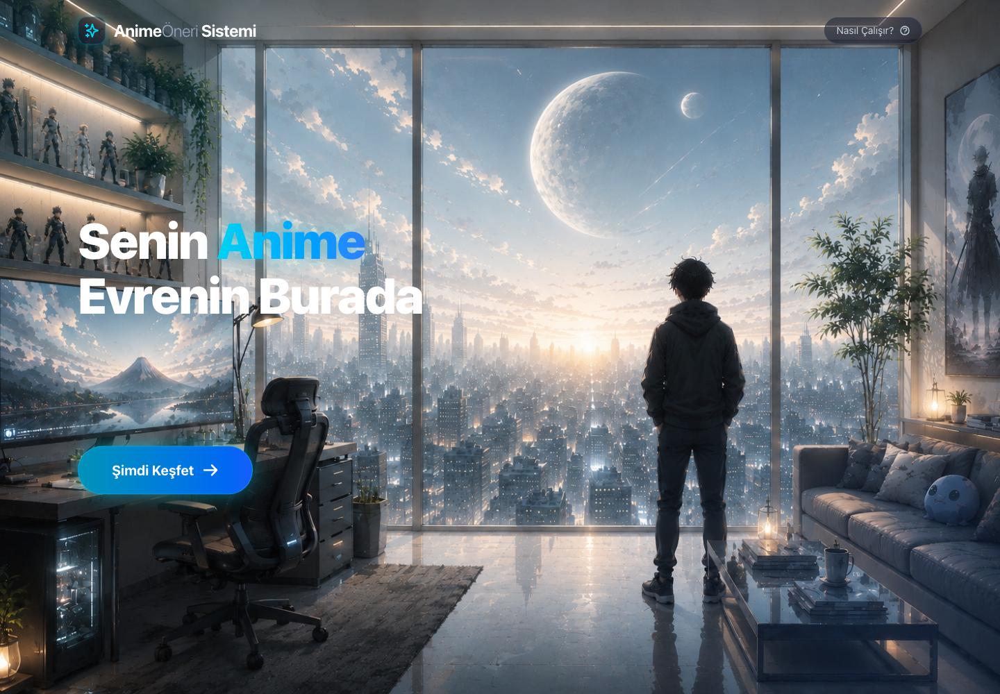
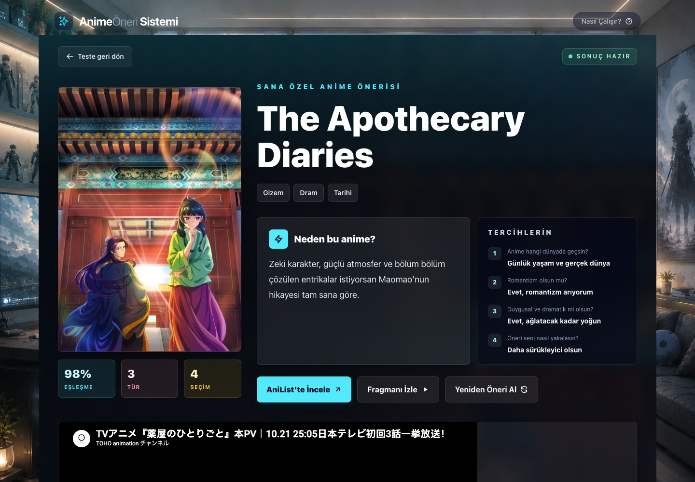
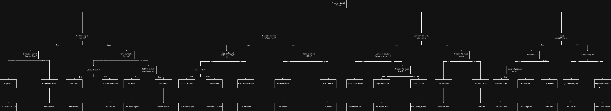

# Anime Recommendation System

Kullanıcının anime tercihlerini, izleme modunu ve hikâye beklentilerini analiz ederek kişiselleştirilmiş anime önerileri sunan modern ve etkileşimli web uygulaması.




---

## Proje Hakkında

Anime Recommendation System, kullanıcıların verdiği cevaplara göre anime önerileri sunan React tabanlı bir öneri sistemidir.

Uygulama; atmosfer, hikâye yapısı, tempo, duygu ve tür tercihlerini kısa bir karar ağacı akışıyla analiz ederek kullanıcıya en uygun animeyi önerir.

Sistem ayrıca AniList GraphQL API entegrasyonu sayesinde:

- Anime posterlerini
- Tür bilgilerini
- Fragman bağlantılarını
- Benzer anime önerilerini

dinamik olarak göstermektedir.

---

## Özellikler

- Karar ağacı tabanlı öneri sistemi
- Dinamik soru-cevap akışı
- Kullanıcı tercihlerine göre anime eşleştirme
- Anime posteri, açıklama ve tür bilgileri
- AniList detay bağlantıları
- YouTube fragman desteği
- Benzer anime önerileri
- Responsive ve modern kullanıcı arayüzü
- AniList GraphQL API entegrasyonu
- Modüler React component yapısı

---

## Ana Ekran

Projenin giriş ekranı sinematik ve anime temalı modern bir atmosfer oluşturacak şekilde tasarlanmıştır.



---

## Öneri Sonucu

Kullanıcı tercihleri tamamlandıktan sonra sistem; eşleşme oranı, tercih özeti, anime posteri, açıklama, fragman ve alternatif öneriler içeren sonuç ekranını gösterir.



---

## Karar Akışı

Uygulama, `src/data/animeDecisionTree.json` dosyasındaki karar ağacını kullanmaktadır.

Kullanıcı adım adım tercihlerine göre soruları cevaplar ve sistem en uygun anime sonucuna yönlendirme yapar.



---

## Kullanılan Teknolojiler

- React 19
- Vite 8
- Tailwind CSS 4
- ESLint
- AniList GraphQL API

---

## Proje Yapısı

```text
.
├── docs/
│   └── assets/
│       ├── banner.png
│       ├── homepage-preview.png
│       ├── result-preview.png
│       └── decision-tree.png
├── public/
│   ├── ani.png
│   ├── favicon.svg
│   └── icons.svg
├── scripts/
│   └── updateAnimeMedia.mjs
├── src/
│   ├── components/
│   │   ├── FinalQuestionCard.jsx
│   │   ├── HeroSection.jsx
│   │   ├── MatchingScreen.jsx
│   │   ├── QuestionCard.jsx
│   │   └── ResultCard.jsx
│   ├── data/
│   │   └── animeDecisionTree.json
│   ├── utils/
│   │   └── decisionEngine.js
│   ├── App.jsx
│   ├── index.css
│   └── main.jsx
├── eslint.config.js
├── index.html
├── package.json
└── vite.config.js
```

---

## Kurulum

Projeyi klonlayın:

```bash
git clone https://github.com/kullanici-adin/anime-recommendation-system.git
cd anime-recommendation-system
```

Bağımlılıkları yükleyin:

```bash
npm install
```

Geliştirme sunucusunu başlatın:

```bash
npm run dev
```

Uygulama varsayılan olarak şu adreste çalışır:

```text
http://localhost:5173
```

---

## Kullanılabilir Komutlar

```bash
npm run dev          # Geliştirme sunucusunu başlatır
npm run build        # Production build oluşturur
npm run preview      # Build çıktısını lokal olarak önizler
npm run lint         # ESLint kontrolü çalıştırır
npm run media:update # AniList API üzerinden anime verilerini günceller
```

---

## Veri Modeli

`animeDecisionTree.json` dosyası iki temel düğüm tipiyle çalışır:

### Question Node

Kullanıcıya soru ve seçenekler gösterir.

### Result Node

Aşağıdaki bilgileri içerir:

- Anime adı
- Açıklama
- Türler
- Poster görseli
- Fragman bağlantısı
- Öneri gerekçesi
- Alternatif anime önerileri

Karar ağacı yapısı:

```text
src/utils/decisionEngine.js
```

dosyası içerisinde validate edilir.

Geliştirme modunda eksik veya kopuk bağlantılar için konsola otomatik uyarı basılır.

---

## Gelecek Güncellemeler

- Kullanıcı giriş sistemi
- Favori anime sistemi
- Yapay zekâ destekli öneri motoru
- İzleme geçmişi sistemi
- Dark / Light mode desteği
- Çoklu dil desteği
- Kullanıcıya özel öneri hafızası

---

## Bu Projeyi Neden Geliştirdim?

Bu proje, üniversite ders projesi kapsamında frontend geliştirme ve öneri sistemi mantığını deneyimlemek amacıyla geliştirilmiştir.

Amaç; klasik listeleme mantığından farklı olarak kullanıcıya daha sinematik, etkileşimli ve immersif bir anime keşif deneyimi sunmaktır.

---

## License

MIT License

---

## Geliştirici

**Alamger Shams**

Bilgisayar Mühendisliği Öğrencisi  
AI & Mobile Developer
